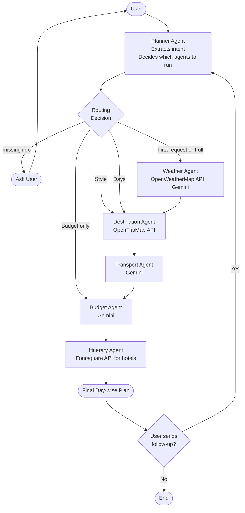

# ✈️ Smart Trip Planning Assistant

A multi-agent trip planner built with **LangGraph**, **Gemini**, and **Serper

(Google Search)**, with a **Streamlit** chat UI. The agents run as a fixed

**sequence**; the Planner gates on missing info. Every result is **fetched live**

— there is no hard-coded list of places, costs, or rules anywhere.

## Workflow



(Run `python graph/workflow.py` to also regenerate `graph_diagram.png`.)

## How each step works

1. **Extractor** — Gemini pulls `destination, dates/month, days, budget, style`

  from the message (regex fallback if the LLM is off). No hard-coded places.

2. **Planner** — checks the three must-haves (**destination, month, budget**) and

  asks the user if any are missing; otherwise the sequence proceeds.

3. **Weather + Best time** — OpenWeather (live conditions) + Serper for the month

  outlook and the best time to visit. *(No LLM call — saves quota.)*

4. **Destination** — Serper fetches the top places to visit.

5. **Transport** — Serper fetches how to reach the place and how to get around.

6. **Budget** — Serper gathers live cost research, then **Gemini** returns an

  itemised JSON estimate (accommodation, food, local transport, sightseeing,

  intercity) **with a per-day breakdown that varies by day**.

7. **Itinerary / Composer** — Gemini writes a guided **day-by-day** plan

  (Morning / Afternoon / Evening + Stay + per-day cost), then an expense summary

  and a short "why these choices".

## Saving LLM quota

Serper handles weather, best-time, destination and transport, so **Gemini is used

only 3 times per plan** (extraction, budget estimate, itinerary). Without Serper

the app still runs but those facts will be limited.

## Setup

```bash

pip install -r requirements.txt

```

Create a `.env` file:

```

GEMINI_API_KEY=your_gemini_key

SERPER_API_KEY=your_serper_key

OPENWEATHER_API_KEY=your_openweather_key

# optional: override the model (default gemini-2.5-flash)

GEMINI_MODEL=gemini-2.5-flash

```

Run:

```bash

streamlit run app.py

```

Open **🔧 Behind the scenes** under the chat to see every tool / API call and its

output, step by step.

## Example

1. `Plan a 3 day trip to Delhi` → asks for **travel month** and **budget**.

2. `December, budget 30000` → full guided itinerary + per-day costs + expense table.

## Project structure

```

Trip_Planner-main/

├── app.py                    # Streamlit UI + behind-the-scenes panel

├── graph/

│   ├── state.py              # shared TripState

│   └── workflow.py           # sequential LangGraph wiring

├── agents/

│   ├── extractor.py          # plain text → facts

│   ├── planner.py            # missing-info gate

│   ├── weather_agent.py      # weather + best time (no LLM)

│   ├── destination_agent.py  # top places (Serper)

│   ├── transport_agent.py    # reach + local transport (Serper)

│   ├── budget_agent.py       # LLM cost estimate (Serper-grounded)

│   └── itinerary_agent.py    # day-wise composer (Gemini)

├── prompts/                  # prompt builders

├── services/                 # llm (Gemini), serper, weather

└── utils/helpers.py          # regex fallback parsing (no hard-coded data)

```
